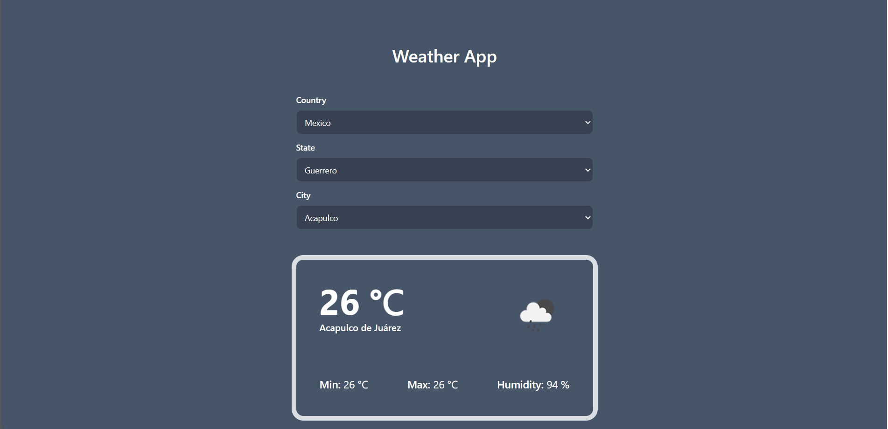

## Weather App 🌡️

This mini project consists of being able to select any city on the planet and be able to obtain its current climatic condition in which it is located at that moment, for this purpose APIs such as [Univeral Tutorial](https://www.universal-tutorial.com/) and [OpenWeather](https://openweathermap.org/).

  
  

 